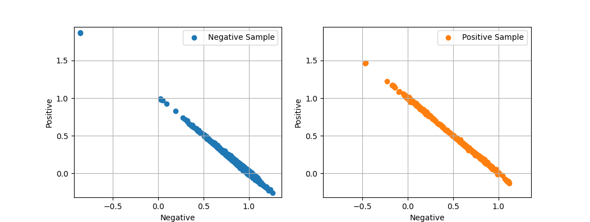
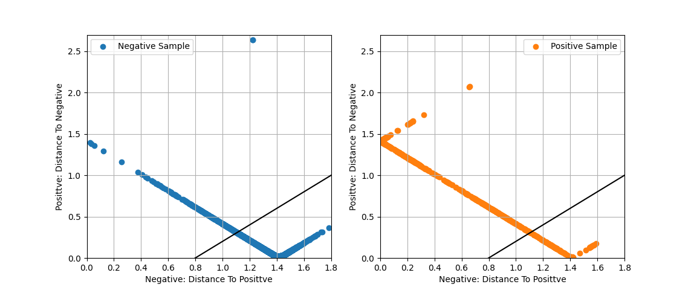
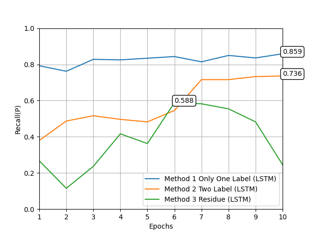

# Quality-Inspection-of-SST

## 背景

数据的质量问题可能会影响数据应用研究结果的准确性, 特别是海洋监测数据受复杂环境、传感设备精度等的影响严重，易出现数据质量问题，因此有必要开展数据的质量控制工作。海洋数据质量控制旨在根据一定的规则给数据打上相应的标签。

---

## 数据集

| 时间 | 纬度 | 经度 | 海表温度 | 质控符 |
| :-: | :-: | :-: | :-: | :-: |
| 202002120204 | 27.84 | 262.93 | 25.4 | | 
| 202004121513 | 45.78 | 275.28 | 7.1 | S |

第一列为时间，将时间数据分割为以年份、月份、日份、小时、分钟，，例如202002120204表示2020年2月12日02时04分；第二列为纬度，其范围为-90\~+90度；第三列为经度，其范围为0~360度，第四列为海表温度，没有范围，第五列为质控符，有S标志为异常数据，其余为正常数据。

训练集包含数据9570734条，正常数据9411252条，异常数据159483条。

测试集包含数据50001条，正常数据49350条，异常数据651条。

下面指代正常数据为阴性样本，异常数据为阳性样本

---

## 评价指标

因为阴性样本和阳性样本的数量差距过大，因此只考虑召回率：

$$R=\frac{TP}{TP+FN}$$

牺牲一部分阴性样本，在保证阴性样本的召回率不低于0.99的情况下，尽可能提高阳性样本的召回率。

---

## 不同的方法

### 方法1 单标签

**输入**：[年份，月份，日份，小时，分钟，纬度，经度，海表温度]

**输出**：阴性样本的质控符为[0]，阳性样本的质控符为[1]

网络对输入预测1个标签值 $\hat y$，通过调整 $\theta$ 来区分阴性样本和阳性样本：

* $\hat y \le \theta$，预测结果为阴性
* $\hat y > \theta$，预测结果为阳性

### 方法2 多标签

**输入**：[年份，月份，日份，小时，分钟，纬度，经度，海表温度]

**输出**：阴性样本的质控符为[1,0]，阳性样本的质控符为[0,1]

测试集的预测结果分布，如下图（越靠近[1,0]阴性概率越大，越靠近[0,1]阳性概率越大）：

为了方便通过单个阈值调整选取比例，所以通过计算点到[1,0]和[0,1]的距离，将数据映射到新的坐标系中，如下图：

在新坐标系中，x轴坐标越大，表示距离[0,1]距离越远，即阴性概率越大；y轴坐标越大，表示距离[0,1]距离越远，即阳性概率越大，因此直线x=y上的样本点，表示阴性和阳性概率相同。

计算所有点到直线 $x-y=0$ 的距离 $D=\frac{x-y}{\sqrt{2}}$，并增加阈值 $\theta$：

* $D \ge \theta$，预测结果为阴性
* $D < \theta$，预测结果为阳性

其实也通过补偿数据熵的方法来调整的🚀。

### 方法3 残差

上面的方法都是标签法，考虑到阳性样本存在随机性，监督学习无法良好区分，因此尝试使用实际值和预测值的残差（绝对误差 ）来分析。

训练数据仅采用训练集中的阴性样本。

**输入**：[年份，月份，日份，小时，分钟，纬度，经度]

**输出**：[海表温度]

预测海表温度，计算实际值与预测值的绝对误差，通过调整阈值 $\theta$ 区分阴性样本和阳性样本。

---

## 网络结构

### 网络结构1 全连接

* 输入层（全连接）
* 隐藏层1（全连接）：256个神经元，ReLU
* 隐藏层2（全连接）：256个神经元，ReLU
* 输出层（全连接）

### 网络结构2 LSTM

* 输入层（全连接）
* 隐藏层1（LSTM）：256个神经元，ReLU
* 隐藏层2（全连接）：256个神经元，ReLU
* 输出层（全连接）

数据的离散程度很高，没法提取区域或时间序列，所以 RNN 选择的是零向量，有点可惜。

过拟合问题有所减轻，但效果没有想象中的好，可能对离散数据而言，卷积的效果会更加好一点。

---

## 其他

方法3虽然表现较差，但基于残差的方法应该可取的，只是预测的还不够精准，平均绝对误差有1.48℃，还很高。

其他还找到很多方法，例如 CNN[1]、滤波方法[2]、模态分解[1, 3]、LSTM[4]。

* [1]韩莹,孙凯强,张栋,王乐豪,谈昊然.一种基于深度学习的海表温度混合预测方法[J].海洋环境科学,2022,41(05):791-798.
* [2]吉进喜,张立凤,郭渊.Kalman滤波技术在海表温度预测中的应用[J].海洋预报,2010,27(03):59-65.
* [3]陈嘉星,江迪,张霄宇.基于动态模态分解的长江口海表温度时空分布特征重构研究[J].浙江大学学报(理学版),2022,49(01):76-84.
* [4]孙际钰. 基于LSTM网络的海表温度预报技术研究[D].大连海洋大学,2022.
